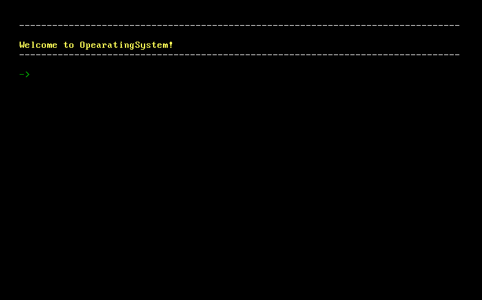
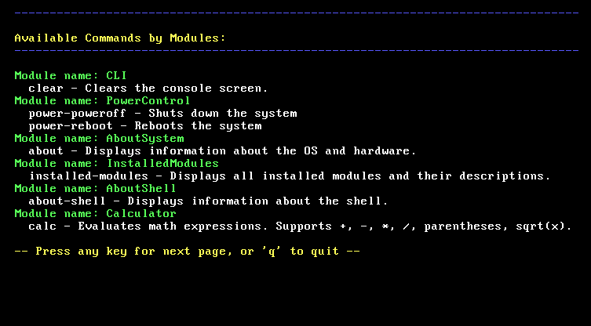

**Page Language: [Русский](README.md) | English**

---

# 🌌 OperatingSystem by TheCreatorOfClearCode

**OperatingSystem by TheCreatorOfClearCode** is a modular, minimalistic operating system written in C# using **[Cosmos](https://github.com/CosmosOS )**. 

---

## 📌 Main Features

- ⚙️ **Modular architecture**
- 🖥️ **Console shell** with support for user commands
- 🧮**Calculator**, help, and other basic utilities
- 💾 **Support for auto-loading/auto-stopping modules**
- 🧩 **Extensibility through proprietary modules and utilities**

**⬇️ [Download](https://github.com/TheCreatorOfClearCode/OperatingSystem-by-TheCreatorOfClearCode/releases/tag/1.0)**
-Once the .iso is downloaded, it can be used in any virtual machine.

---

**[Changelog](CHANGELOG.en.md)**

---

## 📸 Screenshots

> 
> 

---

## 🔧 Project assembly

> Requirements:
- Installed **[Visual Studio 2022](https://visualstudio.microsoft.com)**
- Installed **[Cosmos User Kit](https://github.com/CosmosOS)**
