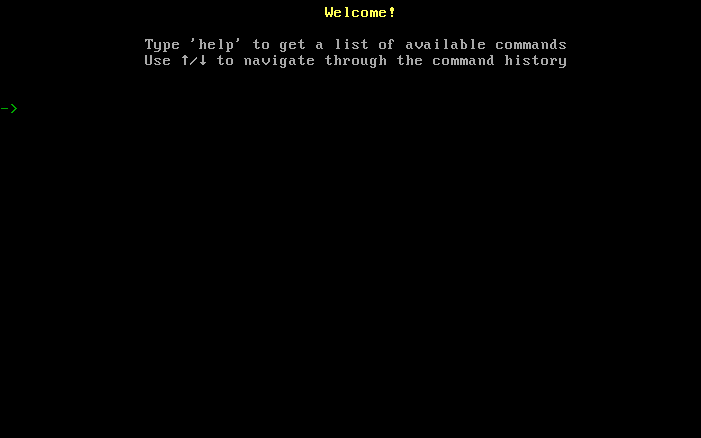

# 🌌 OperatingSystem by TheCreatorOfClearCode

**OperatingSystem by TheCreatorOfClearCode** — минималистичная операционная система, написанная на **C**.  

---

## 📌 Основные особенности

- ⚙️ **Модульная архитектура**
- 🖥️ **Консольная оболочка** с поддержкой пользовательских команд

---

**⬇️ [Скачать](https://github.com/TheCreatorOfClearCode/OperatingSystem-by-TheCreatorOfClearCode/releases/tag/v1.3.2)**

**Ознакомтесь с [журналом изменений](CHANGELOG.md)**

---

## 📸 Скриншоты

> 

---

## 🔧 Сборка проекта

### Требования

- **Хост:** любой дистрибутив Linux
- **Пакеты для сборки:**
  - Debian / Ubuntu:
    ```bash
    sudo apt install build-essential gcc-multilib nasm grub-pc-bin xorriso
    ```
  - Arch Linux:
    ```bash
    sudo pacman -S base-devel gcc-multilib nasm grub xorriso
    ```

### Инструкция по сборке

1. Клонируйте репозиторий:
   ```bash
   git clone https://github.com/TheCreatorOfClearCode/OperatingSystem-by-TheCreatorOfClearCode.git
   cd OperatingSystem-by-TheCreatorOfClearCode
2. Соберите проект:
    ```bash
   make
    ```
3. В каталоге появится готовый ISO-образ для запуска в эмуляторе.

## 📚 Технические детали
- Проект использует собственную реализацию стандартной библиотеки C (`string`), 
  написанную полностью с нуля и не основанную на сторонних решениях.
- Для загрузки используется **GRUB**, который поддерживает спецификацию Multiboot.  
 GRUB загружает ISO-образ, находит секцию с заголовком Multiboot и передаёт управление собственному загрузчику `boot.s`.
