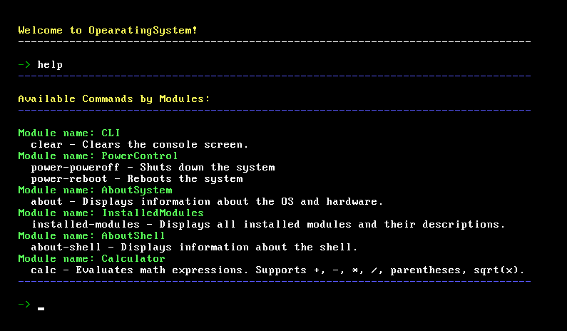

**Page Language: [Русский](README.md) | [English](README.en.md)**

---

# 🌌 OperatingSystem by TheCreatorOfClearCode

**OperatingSystem by TheCreatorOfClearCode** — модульная минималистичная операционная система, написанная на C# с использованием **[Cosmos](https://github.com/CosmosOS)**.  

---

## 📌 Основные особенности

- ⚙️ **Модульная архитектура**
- 🖥️ **Консольная оболочка** с поддержкой пользовательских команд
- 🧮 **Калькулятор**, справка, и другие базовые утилиты
- 💾 **Поддержка автозагрузки/автоостановки модулей**
- 🧩 **Расширяемость через собственные модули и утилиты**

**⬇️ [Скачать](https://github.com/TheCreatorOfClearCode/OperatingSystem-by-TheCreatorOfClearCode/releases/tag/1.0)**
- Как только .iso скачается его можно использовать в любой виртуальной машине.

---

## 📸 Скриншоты

> 
> 

---

## 🔧 Сборка проекта

> Требования:
- Установлен **[Visual Studio 2022](https://visualstudio.microsoft.com/)**
- Установлен **[Cosmos User Kit](https://github.com/CosmosOS/Cosmos/releases)**

### Инструкция по сборке:

```
1. Откройте OS.sln в Visual Studio 2022
2. Соберите проект (Ctrl + Shift + B)
3. Нажмите "Start" (или F5), чтобы запустить в VMWare
